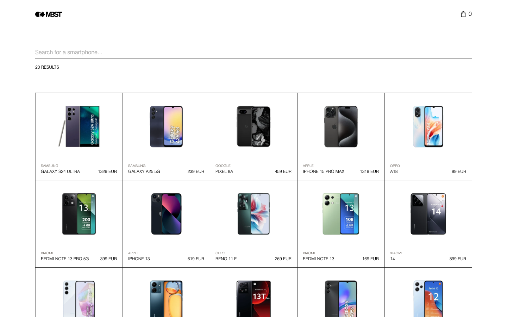
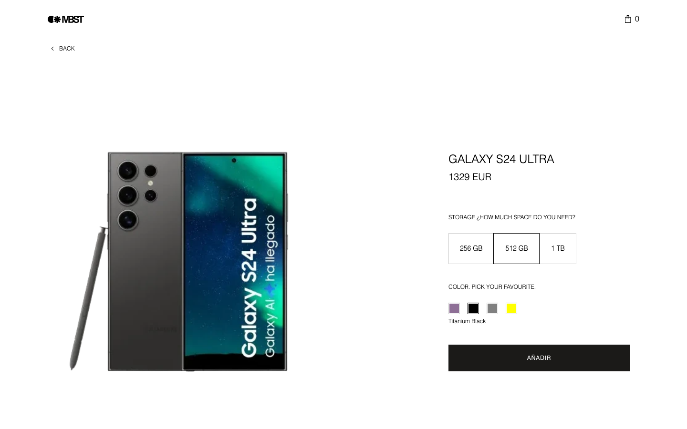
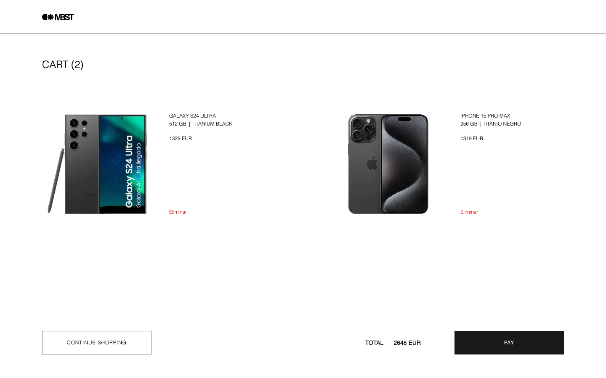
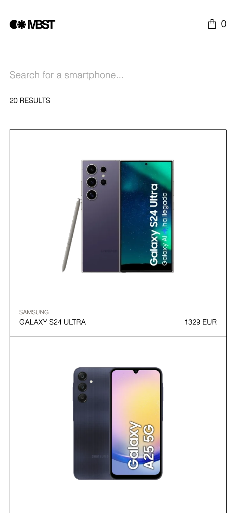
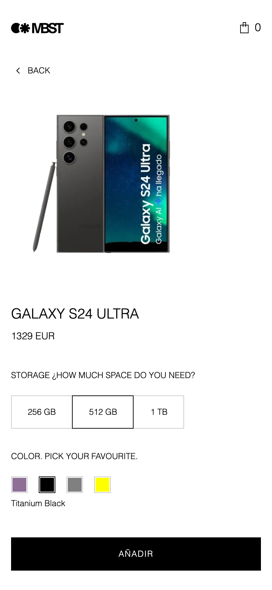
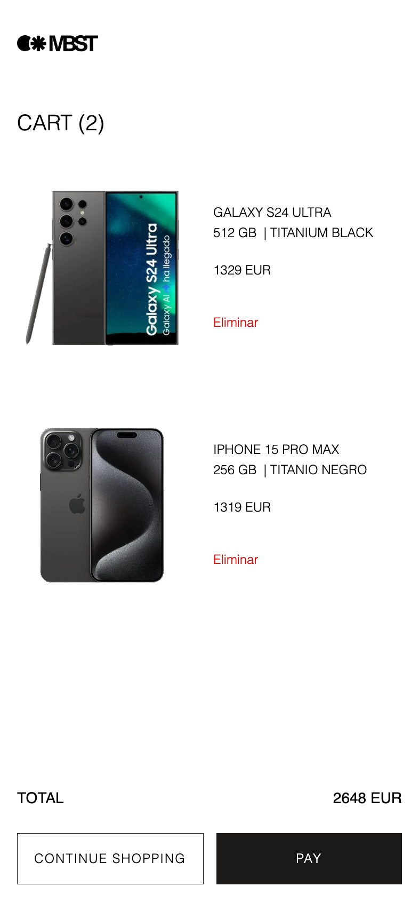

# MBST — Smartphones

[English](README.md) · **Español**

Una tienda de smartphones hecha con Next.js 15 y React 19: recorrer y buscar en el catálogo, configurar un teléfono y guardar un carrito.

- **Listado** (`/`): los 20 primeros teléfonos, búsqueda en tiempo real que muestra todas las coincidencias con su número, y la búsqueda guardada en la URL.
- **Detalle** (`/product/[id]`): foto por color, selectores de almacenamiento y color con el precio actualizándose al elegir, especificaciones y teléfonos similares.
- **Carrito** (`/cart`): una línea por cada teléfono añadido, eliminación, total y estado vacío.

**Demo:** [https://zara.oscarsancho.dev](https://zara.oscarsancho.dev)

| Listado                                                                  | Detalle                                                                      | Carrito                                                     |
| ------------------------------------------------------------------------ | ---------------------------------------------------------------------------- | ----------------------------------------------------------- |
|  |  |  |
|        |        |        |

Resultados de búsqueda: [escritorio](docs/screenshots/search-desktop.png), [móvil](docs/screenshots/search-mobile.png).

## Revisarlo en 15 minutos

Cinco archivos, en este orden, enseñan todo el diseño:

1. [`src/app/page.tsx`](src/app/page.tsx): una página de servidor, el punto de composición que entrega el adaptador real al caso de uso.
2. [`src/core/product/application/get-products.ts`](src/core/product/application/get-products.ts): un caso de uso, el único sitio que conoce la regla del listado: los 20 primeros teléfonos únicos, o todas las coincidencias únicas de una búsqueda.
3. [`src/services/api-client.ts`](src/services/api-client.ts): la única puerta a la API, donde viven la key, los errores, la caché y los timeouts.
4. [`src/core/cart/domain/cart-reducer.ts`](src/core/cart/domain/cart-reducer.ts): las reglas del carrito, funciones puras sin React ni navegador.
5. [`src/components/product-detail/product-detail.tsx`](src/components/product-detail/product-detail.tsx): una vista montada con piezas probadas.

Después, [`e2e/keyboard.spec.ts`](e2e/keyboard.spec.ts) recorre el viaje completo solo con teclado. La calidad de un vistazo: 43 archivos de tests unitarios y de componentes con una comprobación axe en cada página, 11 specs de Playwright sobre el build de producción contra un catálogo fijo (auditoría WCAG 2.2 AA en tres anchos, recorrido con teclado, consola limpia), un spec de contrato contra la API real, y CI en cada pull request.

## Más allá del enunciado, y por qué

Estas piezas cuestan tiempo de lectura, así que cada una está a propósito:

- **Arquitectura hexagonal**: las reglas del catálogo y del carrito se prueban sin Next, y una API nueva o un carrito en servidor son un adaptador más. Ver [Arquitectura](#arquitectura).
- **El carrito guardado se comprueba contra el catálogo**: un carrito puede pasar días en `localStorage` mientras los precios y el stock cambian en una API externa. Ver [Estado](docs/decisions.es.md#estado).
- **Fotos de producto normalizadas**: las fotos de la API son irregulares (fondos blancos, el teléfono ocupando entre el 60 % y el 100 % del encuadre); `/api/images` las lleva al encuadre de Figma. Ver [Rendimiento](docs/decisions.es.md#rendimiento).
- **Movimiento del prototipo de Figma**: sus springs y estados de carga, sin bloquear nunca la interacción y desactivados con `prefers-reduced-motion`. Ver [UI y movimiento](docs/decisions.es.md#ui-y-movimiento).
- **Node 18 de principio a fin**: el enunciado pide Node 18, así que todas las herramientas y el servidor de producción lo usan. Ver [Datos y API](docs/decisions.es.md#datos-y-api).

## Cobertura del enunciado

Cómo se cumple cada punto del enunciado.

| Enunciado                                                                                  | Dónde                                                                                                                          |
| ------------------------------------------------------------------------------------------ | ------------------------------------------------------------------------------------------------------------------------------ |
| Rejilla con los 20 primeros teléfonos: imagen, nombre, marca y precio base                 | `ProductGrid`, `ProductCard`, caso de uso `src/core/product/application/get-products.ts`                                       |
| Búsqueda en tiempo real por nombre o marca, filtrada por la API                            | `ProductSearch` → `/api/products`                                                                                              |
| Número de resultados junto a la búsqueda                                                   | `ResultsCount` (`aria-live`)                                                                                                   |
| Navbar con enlace al inicio y el contador del carrito                                      | `Navbar`, `CartLink`                                                                                                           |
| Carrito persistente (`localStorage`)                                                       | `src/core/cart/infrastructure/local-storage-cart-repository.ts`                                                                |
| Pulsar un teléfono abre su detalle                                                         | Enlace de `ProductCard` a `/product/[id]`                                                                                      |
| Detalle: nombre, marca e imagen grande que cambia con el color                             | `ProductDetail` (nombre en el título, imagen por color), `ProductSpecs` (marca en la tabla de especificaciones, como en Figma) |
| Selectores de almacenamiento y color con precio en tiempo real; precio base y variaciones  | `StorageSelector`, `ColorSelector`, `ProductDetail`                                                                            |
| Especificaciones detalladas                                                                | `ProductSpecs`                                                                                                                 |
| "Añadir" activo solo cuando se han elegido almacenamiento y color                          | `ProductDetail`                                                                                                                |
| Productos similares al final                                                               | `SimilarProducts`                                                                                                              |
| Carrito: imagen, nombre, almacenamiento y color, precio; eliminar; total; seguir comprando | `Cart`, `CartItem`                                                                                                             |
| Responsive y fiel a Figma, Helvetica, Arial, sans-serif                                    | `src/styles/variables.css` y el CSS de cada componente                                                                         |
| Modos de desarrollo (sin minificar) y producción (concatenado y minificado)                | `pnpm dev`, `pnpm build && pnpm start`                                                                                         |
| React ≥ 17, CSS, Node 18, Context API, `x-api-key`                                         | React 19.1, CSS plano, Node 18.20.8, `CartContext`, `src/services/api-client.ts`                                               |
| Tests, accesibilidad, linters y formateadores, consola limpia                              | [Calidad](#calidad), [Accesibilidad](docs/decisions.es.md#accesibilidad)                                                       |
| Opcional: SSR con Next.js y variables CSS                                                  | Server components en el listado y el detalle; tokens en `variables.css`                                                        |
| Opcional: despliegue                                                                       | VPS propio con Node 18 detrás de Cloudflare: [https://zara.oscarsancho.dev](https://zara.oscarsancho.dev)                      |

## Puesta en marcha

Requisitos: **Node 18.20.8** (`.nvmrc`) y **pnpm 10.34.6**.

```bash
nvm use
corepack enable                  # una vez por instalación de Node: proporciona el pnpm fijado
pnpm install --frozen-lockfile
cp .env.example .env.local       # después, rellena API_KEY
```

La instalación falla con otra versión mayor de Node: ver [Herramientas](docs/decisions.es.md#herramientas) para saber cómo se imponen las versiones.

| Variable       | Para qué sirve                                                                                 |
| -------------- | ---------------------------------------------------------------------------------------------- |
| `API_BASE_URL` | URL base de la API de productos, ya definida en `.env.example`.                                |
| `API_KEY`      | Se envía en la cabecera `x-api-key`. Solo en el servidor: nunca con el prefijo `NEXT_PUBLIC_`. |
| `SITE_URL`     | Dirección pública del sitio desplegado, definida antes de `pnpm build`. Vacía en local.        |

## Desarrollo y producción

```bash
pnpm dev                  # desarrollo: recursos sin minificar, fast refresh
pnpm build && pnpm start  # producción: recursos concatenados y minificados en el puerto 3000
pnpm warm-up [url]        # tras arrancar: carga el catálogo y prepara todas las fotos de la lista
```

`pnpm warm-up` ahorra al primer visitante tras un despliegue la espera de las fotos del listado: ver [Rendimiento](docs/decisions.es.md#rendimiento).

## Scripts

| Script                         | Qué hace                                                                                 |
| ------------------------------ | ---------------------------------------------------------------------------------------- |
| `pnpm dev`                     | Servidor de desarrollo.                                                                  |
| `pnpm build`                   | Build de producción.                                                                     |
| `pnpm start`                   | Sirve el build de producción.                                                            |
| `pnpm warm-up [url]`           | Carga el catálogo y prepara todas las fotos de la lista en un servidor recién arrancado. |
| `pnpm lint`                    | ESLint (Next core web vitals, TypeScript, compatibilidad con Prettier).                  |
| `pnpm typecheck`               | `tsc --noEmit`.                                                                          |
| `pnpm format` / `format:check` | Prettier, escribiendo o solo comprobando.                                                |
| `pnpm test`                    | Tests unitarios y de componentes con Vitest.                                             |
| `pnpm test:coverage`           | Lo mismo con cobertura V8 en `coverage/`.                                                |
| `pnpm test:e2e`                | Tests end-to-end de Playwright sobre el build de producción (ver [Calidad](#calidad)).   |
| `pnpm test:e2e:contract`       | Los specs de Playwright que comprueban la app contra la API real.                        |

## Arquitectura

Hexagonal: las reglas de negocio no saben nada de Next, de la API ni del navegador; cada mundo exterior se conecta a través de un puerto.

La regla de dependencias la comprueba ESLint (`import/no-restricted-paths`), así que un import indebido hace fallar `pnpm lint`: el dominio solo importa del dominio, los casos de uso solo del dominio, los adaptadores solo del core y de `services`, y ningún componente, hook o contexto importa un adaptador.

- `src/core/product` y `src/core/cart`: cada uno con su `domain` (tipos, puertos y reglas), `application` (casos de uso) e `infrastructure` (adaptadores).
- `src/app`: rutas y puntos de composición: el único código que nombra un adaptador.
- `src/services`: clientes técnicos que no implementan ningún puerto (cliente de la API, configuración del servidor, normalización de imágenes).
- `src/components`, `src/context`, `src/lib`: la parte de React, que recibe sus repositorios.
- `e2e`: specs de Playwright, la API falsa y su catálogo fijo.

Por qué esta división, cómo se prueba y cómo llega una petición a la API: [Arquitectura en detalle](docs/decisions.es.md#arquitectura-en-detalle).

## Decisiones

El razonamiento de cada decisión está en [docs/decisions.es.md](docs/decisions.es.md): [datos y API](docs/decisions.es.md#datos-y-api), [estado](docs/decisions.es.md#estado), [UI y movimiento](docs/decisions.es.md#ui-y-movimiento), [cómo se leyó el diseño de Figma donde dejaba margen](docs/decisions.es.md#interpretación-de-figma), [rendimiento](docs/decisions.es.md#rendimiento) y las [peculiaridades de la API](docs/decisions.es.md#peculiaridades-de-la-api) y cómo se resuelve cada una.

## Calidad

- **Tests unitarios y de componentes** (Vitest, Testing Library), con nombres que describen lo que vive el usuario.
- **Comprobaciones de accesibilidad** con vitest-axe en todas las páginas. jsdom no carga CSS, así que el contraste lo comprueba la auditoría axe end-to-end.
- **Tests end-to-end** (Playwright, solo Chromium) sobre el build de producción, contra una API falsa con un catálogo fijo, así que una ejecución nunca depende de la red: los recorridos del usuario, el teclado solo, una auditoría axe en tres anchos, las cabeceras de seguridad y la consola limpia. Ver [Tests en detalle](docs/decisions.es.md#tests-en-detalle).
- **Specs de contrato** (`pnpm test:e2e:contract`) sobre el build de producción contra la API real, sin ningún teléfono, precio o recuento escrito en ellos.
- **Pre-commit**: Husky ejecuta lint-staged (ESLint y Prettier sobre los archivos preparados).
- **CI** (GitHub Actions, cada acción fijada a un SHA de commit): comprobación de formato, lint, typecheck, tests con cobertura y build, con umbrales de cobertura que hacen fallar la ejecución si la cobertura baja. Después, tres jobs independientes: SonarCloud, sobre la cobertura del primer job; la suite end-to-end, sin secretos; y los specs de contrato, con los secretos de la API. Los dos últimos suben el informe de Playwright si fallan. Un token de Sonar ausente o una caída de SonarCloud solo pueden hacer fallar el primero, y una API lenta o que haya cambiado solo el último.
- **Accesibilidad y SEO**: qué se hace en cada caso, en [Accesibilidad](docs/decisions.es.md#accesibilidad) y [SEO](docs/decisions.es.md#seo).
- **Flujo de Git**: una rama por cambio, Conventional Commits, y cada cambio fusionado mediante una [pull request](https://github.com/osancho/prueba-tecnica/pulls?q=is%3Apr) cuando pasa la CI. El repositorio se recreó el 3 de octubre de 2026; las fusiones #1 a #32 corresponden a pull requests de la copia anterior.

## Limitaciones conocidas

- Un producto que no existe muestra la página "no encontrado" con HTTP 200 y `noindex`: la ruta tiene estado de carga, así que Next ya ha enviado el 200 cuando se ejecuta `notFound()`. Las rutas desconocidas devuelven 404.
- Algunas fotos originales tienen un reflejo opaco en el suelo bajo el teléfono (por ejemplo, el Pixel 8a) que no se puede separar del dispositivo con seguridad. Se deja tal cual; la corrección corresponde a la imagen original.
- La suite end-to-end corre sobre una grabación del catálogo (4 de octubre de 2026) con fotos dibujadas. Un cambio en la API real o en sus fotos solo lo ven los specs de contrato, que dependen de que la API real esté accesible.
- La caché de imágenes normalizadas vive en el proceso del servidor y se vacía al reiniciarlo; `pnpm warm-up` la vuelve a llenar para la lista. Una CDN delante, como Cloudflare en la demo, sigue sirviendo las fotos que ya tiene.
- No hay diseño para los estados de 404, error y búsqueda fallida, ni para el mensaje de cambios del carrito: usan los tokens existentes con estilos mínimos.
- Avisos de seguridad aceptados, todos los que informa `pnpm audit` (3 altos, 2 moderados):
  - Altos, `sharp` (GHSA-f88m-g3jw-g9cj, libvips; GHSA-rgj7-g3m4-5g8c, libheif): la app solo procesa imágenes del host de la API (los usuarios no pueden subir ninguna), y sharp 0.35.4, que corrige los dos, necesita Node 20.
  - Alto, `braces` (GHSA-vfj7-8cjw-p6xm, patrones muy anidados): solo en desarrollo, a través de `eslint-config-next` → `fast-glob` → `micromatch`; solo expande los globs de lint de este repositorio y no existe versión corregida.
  - Moderados, `vitest` y `@vitest/mocker` (un mismo aviso, GHSA-82fw-gwwq-j7x9): solo en desarrollo, en el runner de tests; corregido en Vitest 4.1.11, que requiere Node 20.
